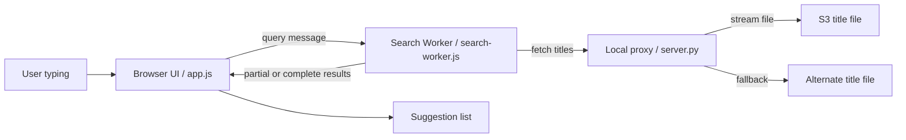
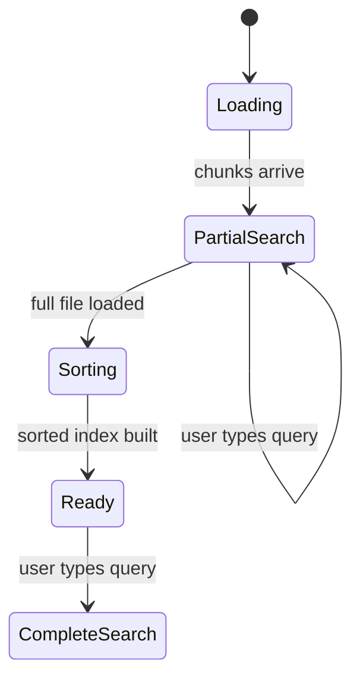
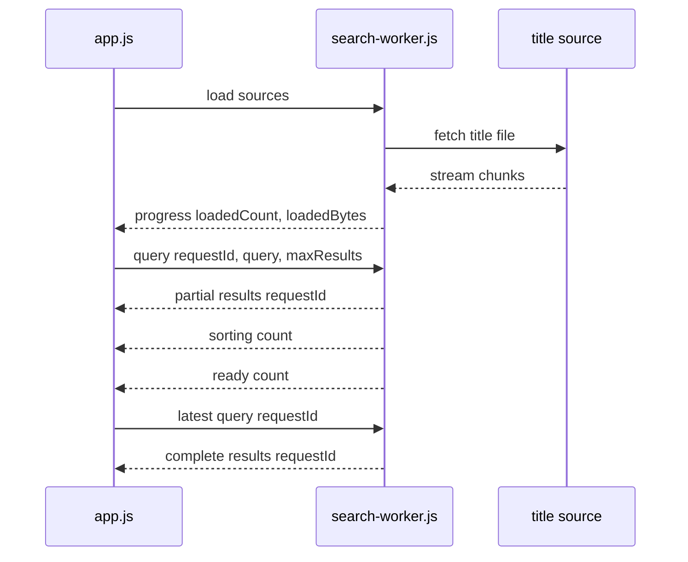
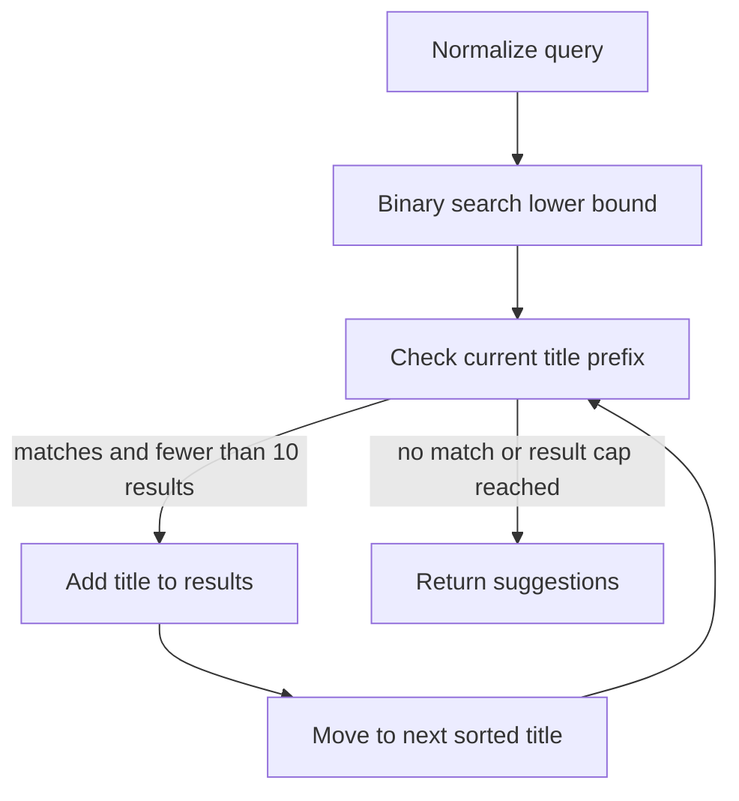

# Wikipedia Title Autocomplete MVP Plan

## Goal

Build a quick browser-based MVP for an interactive autocomplete search feature over Wikipedia page titles.

The app will load a static title dataset once, build an in-memory searchable index, and update suggestions in real time as the user types.

Primary dataset:

```text
https://charta-public.s3.us-east-2.amazonaws.com/interview/wikipedia-latest-titles.txt
```

Alternate dataset:

```text
https://file.notion.so/f/f/c7bb86eb-fa3b-4667-85b8-304db4bd37fc/64c076a6-b90c-4fad-887b-c60cacb5c2db/wikipedia-latest-titles.txt?table=block&id=3d5a0739-fda7-80aa-a720-c9de99b0209e&spaceId=c7bb86eb-fa3b-4667-85b8-304db4bd37fc&expirationTimestamp=1789084800000&signature=x2lh1MYiKYX8JPCte8canfDI4FlJHScD9Rpwtx1Sr0k&downloadName=wikipedia-latest-titles.txt
```

Known dataset constraints:

- File size is approximately 140 MB.
- The file is not sorted.
- The MVP should be buildable quickly, around 30 minutes.

## MVP Scope

Use a simple implementation with vanilla HTML, CSS, JavaScript, and a tiny local Python static/proxy server for development.

Core flow:

```text
enable input immediately -> worker streams title file -> worker builds partial index -> user gets partial suggestions -> worker sorts final index -> binary search serves complete suggestions
```

This keeps the implementation small and focused on the required behavior:

- Prefix matching
- Real-time updates as the user types
- Interactive browser UI
- Progressive partial results while the full dataset loads
- Background indexing through a Web Worker
- No external libraries required
- No production backend required

## System Architecture

The MVP uses a split architecture:

- The browser main thread owns the user interface.
- A Web Worker owns expensive dataset work.
- The dataset is fetched from a same-origin local proxy when available, then falls back to remote sources.



The important design choice is that the input is available immediately. The search results may be incomplete while the dataset is still loading, but the interface remains usable.

## Runtime Modes

The worker has two search modes.



### Partial Search Mode

While the file is still loading:

- The worker parses streamed chunks into complete title lines.
- Each title is normalized.
- The title is stored in an in-memory list.
- The title is also added to a lightweight first-character bucket.
- Queries search only the titles loaded so far.
- Results are labeled as partial in the UI.

This lets the user type immediately instead of waiting for the whole 140 MB file to download and sort.

### Complete Search Mode

After the full file is loaded:

- The worker clears the temporary bucket map.
- The worker sorts the full normalized title index.
- Future queries use binary search.
- Results are complete for the full dataset.

## Core Files

### `index.html`

Responsibilities:

- Define the page structure.
- Include the search input.
- Include a status area for loading/indexing messages.
- Include a suggestions list container.
- Load `styles.css` and `app.js`.

Expected UI elements:

- Search input
- Loading/status text
- Suggestions list

### `styles.css`

Responsibilities:

- Style the search interface.
- Style the suggestions dropdown/list.
- Provide hover and selected states.
- Keep the UI readable and responsive.

Expected styling:

- Centered search area
- Clear loading state
- Suggestion rows
- Highlighted selected suggestion
- Basic mobile-friendly layout

### `app.js`

Responsibilities:

- Enable the input immediately.
- Start the search worker.
- Send user queries to the worker.
- Ignore stale worker responses using request IDs.
- Render partial and complete suggestions.
- Update loading, sorting, ready, and error states.
- Listen for input changes.
- Handle basic keyboard interaction.

### `search-worker.js`

Responsibilities:

- Fetch the title file in the background.
- Stream and parse the response incrementally when supported by the browser.
- Normalize titles for matching.
- Maintain a partial in-memory index while loading.
- Search loaded titles before the final index is ready.
- Sort the completed title index.
- Run binary-search prefix lookup after sorting.
- Send progress, result, ready, and error messages back to `app.js`.

### `server.py`

Responsibilities:

- Serve the static files from `dist/`.
- Expose `/wikipedia-latest-titles.txt` as a same-origin endpoint.
- Stream the remote title file from the primary S3 source.
- Fall back to the alternate Notion source if needed.
- Avoid loading the full title file into the Python server process.

## Data Loading

On page load:

1. Enable and focus the search input immediately.
2. Show a loading message that makes partial results clear.
3. Start `search-worker.js`.
4. Send dataset source URLs to the worker.
5. The worker fetches `/wikipedia-latest-titles.txt` from the local static/proxy server.
6. The local server streams the remote S3 file.
7. If the S3 fetch fails, the server tries the alternate Notion-hosted file.
8. The worker parses title lines as chunks arrive.
9. The worker sends progress updates to the UI.
10. The worker answers queries against loaded titles while the full file is still loading.
11. When loading is complete, the worker sorts the final index.
12. After sorting, the worker answers queries using binary search.

Current MVP approach:

```text
worker fetch -> stream chunks -> parse complete lines -> partial bucket search -> final sort -> binary search
```

If streaming is not supported, the worker can fall back to:

```text
response.text() -> split(/\r?\n/)
```

This fallback may use significant memory, but it keeps the MVP compatible with more browsers.

## Message Flow

The main thread and worker communicate with structured messages.



Message types:

- `load`: sent by `app.js` to start loading data.
- `progress`: sent by the worker while titles are streaming.
- `query`: sent by `app.js` whenever the input changes.
- `results`: sent by the worker with either partial or complete matches.
- `sorting`: sent by the worker when the full file has loaded and final sorting begins.
- `ready`: sent by the worker when binary-search mode is available.
- `error`: sent by the worker if all dataset sources fail.

## Normalization

Normalize both the query and each title so prefix matching is predictable.

Recommended normalization:

- Trim whitespace.
- Convert to lowercase.
- Replace underscores with spaces.
- Collapse repeated spaces.

Example:

```text
Original:   New_York_City
Normalized: new york city
```

Preserve the original title for display.

## Index Structure

Use a lightweight array tuple instead of object records to reduce memory overhead.

Recommended shape:

```text
[normalizedTitle, originalTitle]
```

Example:

```text
["new york city", "New_York_City"]
```

After building the array, sort it by `normalizedTitle`.

While loading, the worker also keeps temporary first-character buckets:

```text
Map<firstCharacter, Array<[normalizedTitle, originalTitle]>>
```

Example:

```text
"n" -> [
  ["new york city", "New_York_City"],
  ["new zealand", "New_Zealand"]
]
```

The bucket map is only used for partial search. It is cleared after the final sorted index is ready to reduce memory pressure.

## Prefix Search

The system supports two prefix-search algorithms.

### Partial Search Algorithm

While loading:

1. Normalize the query.
2. Find the first-character bucket for the query.
3. Scan only that bucket.
4. Keep titles whose normalized title starts with the query.
5. Stop after collecting the desired number of suggestions, such as 10.

This is not complete because the full file has not loaded yet, but it gives immediate feedback.

### Final Binary Search Algorithm

After indexing is complete:

1. Normalize the query.
2. Use binary search to find the first item whose normalized title is greater than or equal to the query.
3. Walk forward from that point while titles start with the query.
4. Stop after collecting the desired number of suggestions, such as 10.



Search behavior:

1. Normalize the current query.
2. If the query is empty, clear suggestions.
3. Binary search the sorted index.
4. Collect the first matching titles.
5. Render the suggestions.

This avoids scanning every title on every keystroke.

## Interactivity

Listen to the input's `input` event.

On every query change:

- Normalize the query.
- Run prefix search.
- Render the latest suggestions.

Because search happens locally after indexing, debouncing is optional. If rendering feels too eager, add a small debounce of 50-100ms.

To avoid stale results, every query message includes a monotonically increasing request ID. The UI ignores a `results` message when its request ID is older than the latest query.

## Keyboard And Mouse Support

For the MVP, support:

- `ArrowDown`: move selected suggestion down.
- `ArrowUp`: move selected suggestion up.
- `Enter`: open the highlighted suggestion.
- `Escape`: clear or close suggestions.
- Mouse click: open a suggestion.

Each suggestion should be a clickable Wikipedia link.

Links are formed by prepending `http://wikipedia.org/wiki/` to the encoded title path.

## Search History

When the search box is empty, show recent search queries from browser `localStorage`.

For the MVP:

- Save a query when the user opens a result.
- Keep only a small number of recent queries, such as 6.
- Deduplicate queries case-insensitively.
- Clicking a history item should restore that query and run the search again.

## Loading And Error States

During loading/indexing:

- Keep the input enabled.
- Show a message like `Loading titles... you can start typing now`.
- Mark early results as partial because they only cover titles loaded so far.

After indexing:

- Show a ready message with the number of loaded titles.
- Continue serving searches from the completed binary-search index.

If loading fails:

- Show an error message.
- Keep the input enabled, but make it clear that no dataset is available.
- Optionally expose a retry path.

## Explicit Non-Goals For 30-Minute MVP

Skip these for the initial version:

- IndexedDB cache
- Pre-sorted or pre-bucketed dataset
- Production backend service
- Fuzzy matching
- Popularity-based ranking
- Complex accessibility implementation

## Known Tradeoffs

The MVP may have slow first load because every browser session downloads, parses, normalizes, and sorts a 140 MB unsorted file.

This is acceptable for a quick prototype, but it is not the ideal production design.

## Implementation Risks To Watch

### Browser Memory Usage

The 140 MB text file can require much more than 140 MB in memory once loaded into JavaScript.

Memory can grow because the app may hold:

- The raw response text.
- The split array of title strings.
- Normalized title strings.
- The sorted index.

To reduce memory pressure in the MVP:

- Avoid object-per-title records.
- Prefer lightweight tuple records like `[normalizedTitle, originalTitle]`.
- Avoid storing extra derived data unless needed.

### Main-Thread Freezing

Parsing, normalizing, and sorting a large title list on the browser main thread can temporarily freeze the UI.

The MVP reduces this risk by moving dataset loading, partial indexing, and final sorting into `search-worker.js`.

The UI thread can still receive input and render status updates while the worker is busy.

### CORS Failure

The S3 file is reachable, but may not be directly fetchable from browser JavaScript because the response may not include local-origin CORS headers.

To reduce this risk for the MVP, use the local Python server to expose the file through a same-origin path.

Direct browser fetches to the remote S3 or Notion URL can remain as fallback attempts, but the local proxy is the reliable development path.

### Slow First Load

Every fresh browser session may need to download and process the full dataset.

The UI should make this clear with a visible loading state and partial-result messaging until the index is ready.

### Normalization Bugs

The query and title index must use the same normalization logic.

If titles are normalized differently from user input, prefix matches may be missing or surprising.

Pay special attention to:

- Case-insensitive matching.
- Underscores versus spaces.
- Leading/trailing whitespace.
- Repeated spaces.
- Unicode and accented characters.

### Binary Search Edge Cases

Binary search needs careful handling around boundaries.

Test cases should include:

- Empty query.
- Query before the first title.
- Query after the last title.
- Query with no matches.
- Query with exactly one match.
- Query with many matches.

### Too Many Matches For Short Prefixes

Short prefixes like `a`, `s`, or `the` may match huge ranges of titles.

Always cap rendered suggestions, such as showing only the first 10 matches.

### Result Ordering Expectations

The MVP will return alphabetically sorted prefix matches.

It will not rank by Wikipedia popularity, recency, or semantic relevance.

This is acceptable for the required prefix-matching MVP, but should be called out if users expect search-engine-like ranking.

### Local Testing Setup

Opening `index.html` directly with `file://` may cause fetch restrictions or different browser behavior.

Use a tiny local static server for testing if direct file loading causes problems.

The first production improvements would be:

1. Preprocess the dataset into a sorted file before serving it.
2. Split the dataset into prefix buckets so the browser only downloads relevant chunks.
3. Cache the processed index in IndexedDB.
4. Add popularity or usage-based ranking if result quality matters.

## Recommended Build Order

1. Create the basic HTML page shell.
2. Add CSS for the input, status, and suggestions list.
3. Add the local static/proxy server.
4. Add the Web Worker.
5. Wire main-thread UI state and worker message handling.
6. Implement worker data fetching.
7. Stream and parse title lines in the worker.
8. Normalize titles and build the partial bucket index.
9. Implement partial bucket search.
10. Sort the final index in the worker.
11. Implement binary search for the completed index.
12. Wire search to the input event.
13. Render partial and complete suggestions.
14. Add result links.
15. Add search history.
16. Add keyboard and mouse selection.
17. Add loading and error states.

## Definition Of Done

The MVP is complete when:

- The page loads in a browser.
- The app fetches the title dataset.
- The search input is usable immediately.
- Early results are marked as partial while the full dataset is still loading.
- Typing a prefix shows matching Wikipedia titles.
- Results update as the user types.
- Matching uses case-insensitive prefix search.
- The app shows up to 10 suggestions.
- Suggested results are clickable Wikipedia links.
- The user can open a suggestion with mouse or keyboard.
- Recent search queries appear when the search box is empty.
